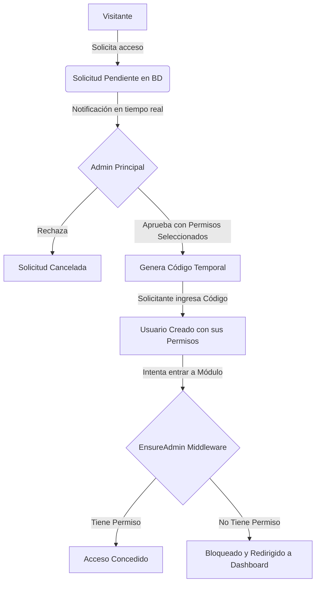

# Documento Descriptivo del Sistema: SuperStock

## 1. Visión General del Sistema
**SuperStock** es una plataforma web profesional para la **Gestión de Inventario Interno de Supermercados**. Diseñado como un monolito robusto y modular sobre el framework **Laravel** y base de datos **MySQL/SQLite**, el sistema está orientado a optimizar, trazar y auditar toda la cadena de abastecimiento física y movimientos de mercancía en un entorno de supermercado.

A diferencia de sistemas comerciales genéricos, SuperStock ha sido construido bajo estrictas directrices de dominio, limitando su alcance exclusivamente al control interno del supermercado. No incluye pasarelas de pago, catálogos públicos ni carritos de compra, lo que garantiza la concentración de recursos en la fiabilidad del control de existencias, seguridad de roles y consistencia de datos de inventario.

---

## 2. Arquitectura de Software y Tecnologías Core
El sistema está estructurado bajo patrones de diseño modernos y limpios:

* **Backend**: Laravel 11.x / 12.x corriendo sobre PHP 8.2+. Utiliza controladores dedicados por recurso, inyección de dependencias, query scopes para lógica reutilizable de base de datos y transacciones seguras de base de datos (`DB::transaction`) para garantizar la integridad referencial.
* **Frontend**: HTML5 semántico estructurado en plantillas Blade de Laravel, estilizado con variables de diseño personalizadas (CSS vainilla con soporte nativo de modo oscuro/claro y variables HSL corporativas).
* **Persistencia**: MySQL (y SQLite para suite de pruebas rápidas en memoria). La base de datos sigue las especificaciones exactas del diagrama entidad-relación del supermercado.
* **Suite de Pruebas (TDD/CI)**: Suite completa de pruebas de funcionalidad y seguridad (Feature y Unit Testing) vía PHPUnit para asegurar que cambios futuros no introduzcan regresiones.

---

## 3. Módulos Implementados en el Sistema

### 3.1. Autenticación y Control de Acceso Seguro
* **Acceso de Usuarios**: Sistema de login y logout robusto con protección contra ataques de fuerza bruta y manejo seguro de sesiones de Laravel.
* **Doble Actor (Roles)**:
  * **Administrador**: Control total sobre la configuración del negocio, gestión de usuarios, auditoría, solicitudes de acceso y catálogos maestros.
  * **Empleado**: Operador del día a día, con capacidades limitadas a búsquedas de stock, consulta de productos e ingreso/egreso de inventario.

### 3.2. Dashboard de Gestión Operativa (KPIs en Tiempo Real)
* **Indicadores Críticos (Cards)**:
  * **Productos Totales**: Conteo total del catálogo activo.
  * **Alertas de Stock Bajo**: Indicador numérico dinámico de productos que están por debajo de su límite de stock mínimo permitido.
  * **Productos Agotados**: Detección de productos con existencia cero.
* **Gráficos e Interactividad**:
  * Visualización de la distribución del inventario.
  * Listado dinámico de movimientos recientes con marcas de tiempo e identificación del operador que los realizó.
  * Accesos rápidos directos a las tareas más frecuentes de control.

### 3.3. Catálogo de Categorías
* **Organización**: Creación, edición y eliminación lógica de categorías que agrupan los productos.
* **Seguridad de Datos**: Prevención de eliminación de categorías que contengan productos activos asociados.

### 3.4. Catálogo de Productos
* **Ficha Técnica**: Administración completa de productos con SKU único, códigos de barras, nombres descriptivos, precio de compra, precio de venta, categoría asociada y límite de stock mínimo.
* **Búsqueda Inteligente**: Buscador integrado por coincidencia de texto en nombre, SKU o código de barras para agilizar el trabajo en bodegas.

### 3.5. Gestión de Proveedores
* **Fichero de Contacto**: Registro de socios de abastecimiento (Nombre de empresa, RUC, dirección, teléfono y correo electrónico de contacto).
* **Trazabilidad**: Permite asociar la procedencia de la mercadería en los movimientos de entrada.

### 3.6. Control Central de Inventario
* **Visualizador de Existencias**: Tabla centralizada de stock consolidado real de cada producto.
* **Alertas Visuales**: Resaltado automático y animado con badges coloridos para indicar productos en estado crítico (Agotado o Stock Bajo).

### 3.7. Historial y Registro de Movimientos (Kárdex Inmutable)
* **Ingresos de Stock**: Registro de nuevas unidades ingresadas especificando proveedor, cantidad, precio de costo y motivo.
* **Egresos/Salidas**: Registro de salidas de stock (por merma, caducidad, devolución, ajuste físico, etc.).
* **Regla de Integridad de Stock**: El sistema prohíbe mediante validaciones estrictas en servidor registrar salidas que resulten en existencias negativas, arrojando una alerta visual.
* **Historial de Auditoría**: Cada movimiento queda sellado con fecha, hora, tipo de movimiento, motivo detallado y el usuario exacto que ejecutó la acción.

### 3.8. Flujo de Activación de Nuevos Administradores
* **Solicitudes de Acceso**: Formulario externo para que los nuevos miembros soliciten acceso de administrador principal.
* **Badge y Notificación en Caliente**: El administrador principal recibe alertas animadas en tiempo real en su barra superior mediante un indicador sobre el ícono de campana (🔔) cuando hay solicitudes pendientes.
* **Panel Rápido Lateral (Quick Panel)**: Un panel interactivo que se desliza desde la derecha y permite al Administrador Principal procesar (aprobar/rechazar) las solicitudes directamente en caliente.
* **Generación de Códigos**: Al aprobar, se genera un código de acceso temporal seguro y de un solo uso que el solicitante ingresará para activar formalmente su cuenta.

### 3.9. Sistema Avanzado de Permisos Modulares
* **Módulos con Privilegios**: Permite al Administrador Principal restringir el acceso a módulos específicos (ej. ocultar el módulo de Usuarios a un empleado para que solo acceda a Inventario, o restringir Proveedores).
* **Asignación en Caliente al Aprobar**: Al momento de aprobar un nuevo administrador, el panel de aprobación incluye checkboxes para definir desde el primer momento a qué partes del sistema tendrá acceso.
* **Gestión en Caliente de Usuarios Existentes**: En la lista de usuarios, se dispone de un botón de "Permisos" que abre un modal de diálogo interactivo (HTML5 `<dialog>` con desenfoque de fondo dinámico) donde se pueden cambiar o retirar accesos individuales en cualquier momento.

---

## 4. Ventajas de Desarrollar Basándose en la Documentación y la Carpeta `spec`

El desarrollo sistemático de SuperStock a partir de la documentación estructurada de la carpeta `spec` (especificaciones) y `docs` (análisis, reglas de negocio) ha aportado ventajas estratégicas y técnicas invaluables:

### 4.1. Coherencia Absoluta de Dominio (Evitar el "Scope Creep")
Tener especificados los alcances del proyecto (con secciones claras de qué está "Dentro de Alcance" y qué queda "Fuera de Alcance" en `vision.md`) protegió al equipo de desarrollo de desvíos innecesarios. Esto evitó gastar tiempo en integraciones complejas e inútiles como carritos de compra o pasarelas de pago, concentrando el esfuerzo en la robustez de las existencias y la auditoría interna.

### 4.2. Consistencia y Normalización de Base de Datos
Basarse en `base_datos.md` y `03-BaseDatos.md` garantizó que las tablas (`users`, `categories`, `products`, `suppliers`, `inventories`, `inventory_movements`, `admin_access_requests`) tuvieran los tipos de datos correctos, las claves foráneas bien definidas y los índices necesarios. Esto previene cuellos de botella de rendimiento y asegura la consistencia de datos históricos (por ejemplo, impidiendo el borrado en cascada de movimientos de stock si se elimina un producto).

### 4.3. Reglas de Negocio Claras y Codificadas
La documentación del comportamiento esperado del inventario (como el principio de no permitir stock negativo y que cada cambio sea trazable) permitió programar validaciones en el backend y base de datos de manera proactiva, en lugar de corregirlas después de que se presentaran fallos en producción.

### 4.4. Aceleración del Onboarding y Facilidad de Mantenimiento
Cualquier programador nuevo que se integre al proyecto puede entender la estructura completa del software en minutos simplemente leyendo `arquitectura.md` y `casos_de_uso.md`. Esto reduce drásticamente el tiempo de inducción técnica y previene que se introduzcan malas prácticas de diseño de software.

### 4.5. Facilidad para la Suite de Pruebas (Testability)
Los casos de uso descritos en `casos_de_uso.md` sirvieron de base directa para escribir las pruebas unitarias y de integración de Laravel. Al tener el comportamiento esperado documentado de antemano, escribir pruebas automatizadas para validar la aprobación de solicitudes, regeneración de códigos, activación de usuarios y restricción de módulos fue directo y 100% efectivo.

---

## 5. Resumen de Flujos Críticos Implementados

Este sistema garantiza que **SuperStock** sea una aplicación segura, auditable y de calidad profesional para el control total del supermercado.
