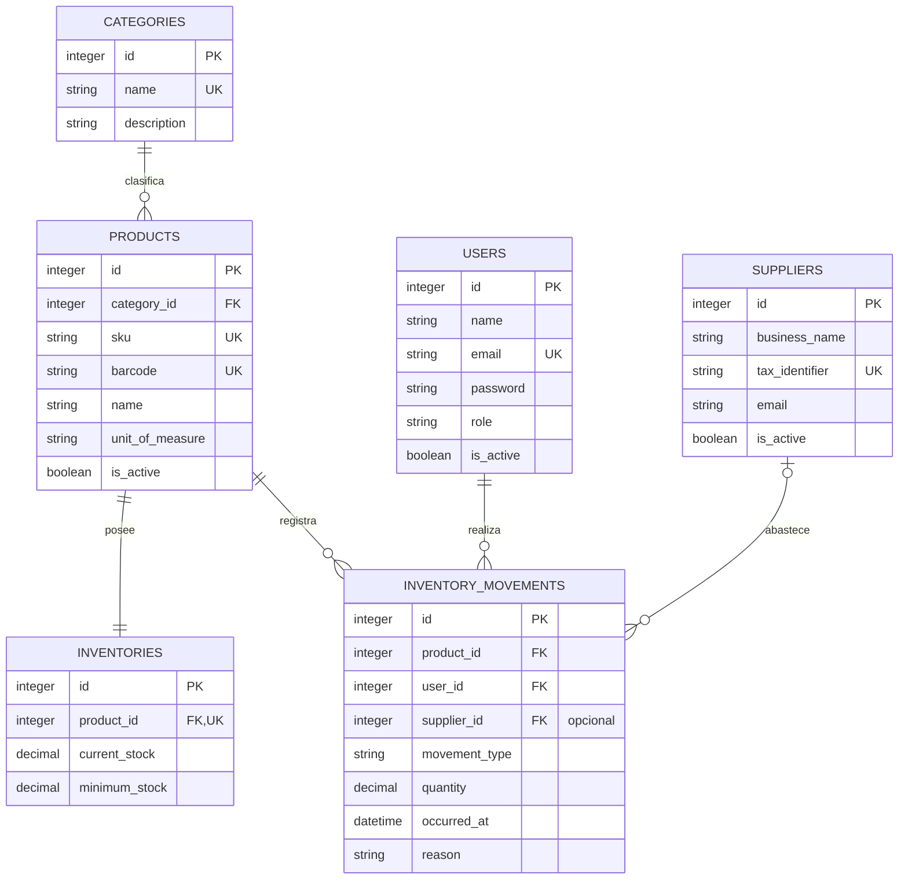

# 1. Introducción

El Modelo Entidad-Relación, denominado MER, es una representación conceptual de los datos que identifica las entidades relevantes de un sistema, sus atributos principales y las relaciones que existen entre ellas. Su finalidad es describir la estructura del dominio antes de tomar decisiones de implementación física o desarrollar componentes de software.

En **SuperStock**, el MER traduce los requisitos funcionales, casos de uso y reglas de negocio en una visión estructurada del dominio de inventario. Permite comprobar que los datos necesarios para autenticar usuarios, clasificar productos, controlar existencias y registrar entradas y salidas se encuentren representados de forma coherente.

Este documento se deriva exclusivamente de `03-BaseDatos.md`, `05-CasosDeUso.md`, `06-ReglasNegocio.md` y de los requisitos aprobados del proyecto. No constituye un script de creación de base de datos ni define detalles propios de Laravel. Su función es servir como referencia conceptual para el diseño físico, las migraciones, los modelos, las relaciones de persistencia y la presentación final de SuperStock.

# 2. Objetivo

Documentar formalmente el Modelo Entidad-Relación de SuperStock, identificando las entidades aprobadas, sus atributos representativos, cardinalidades, condiciones de participación y reglas de integridad.

Los objetivos específicos son:

- Representar de manera comprensible el dominio de datos del sistema.
- Mantener coherencia con el diseño lógico documentado.
- Confirmar las relaciones y cardinalidades aprobadas.
- Facilitar la elaboración posterior del diseño físico de MySQL.
- Proporcionar una referencia para las migraciones y relaciones de Laravel.
- Respaldar la explicación técnica del modelo durante la presentación del proyecto.

# 3. Alcance

El MER comprende exclusivamente las siguientes seis entidades de negocio:

1. `Users`
2. `Categories`
3. `Products`
4. `Suppliers`
5. `Inventories`
6. `Inventory_Movements`

El modelo representa:

- Los usuarios internos con roles de Administrador y Empleado.
- La clasificación obligatoria de los productos.
- El catálogo maestro interno de productos.
- Los proveedores que pueden relacionarse con entradas.
- La existencia vigente y el stock mínimo de cada producto.
- El historial trazable de entradas y salidas.

Quedan fuera del alcance:

- Las tablas internas de Laravel.
- Clientes, ventas, facturación, carrito, checkout y pedidos por WhatsApp.
- Sucursales, bodegas y ubicaciones múltiples en la primera versión.
- Órdenes de compra, pagos y documentos comerciales.
- Cualquier entidad o relación no aprobada en la documentación precedente.

El diagrama mantiene las cardinalidades de la primera versión. Las posibles ampliaciones futuras deberán documentarse y aprobarse antes de alterar este modelo.

# 4. Entidades

## 4.1 Users

Representa las cuentas internas autorizadas para acceder a SuperStock. Conserva la identidad del usuario, sus credenciales protegidas, el rol asignado y el estado de la cuenta.

Esta entidad permite autenticar Administradores y Empleados, aplicar permisos y asociar cada movimiento de inventario con la persona que lo registró. La conservación del usuario responsable garantiza la trazabilidad histórica.

## 4.2 Categories

Representa las clasificaciones utilizadas para organizar los productos del supermercado. Su información se mantiene separada para evitar repetir nombres y descripciones de categorías en cada producto.

Cada producto debe pertenecer obligatoriamente a una categoría válida. Una categoría puede existir antes de que se le asignen productos.

## 4.3 Products

Representa el catálogo maestro interno de artículos gestionados por SuperStock. Contiene la identidad del producto, su categoría, nombre, SKU, código de barras cuando exista, unidad de control y estado.

La entidad describe qué es el producto, pero no cuánto existe. Las existencias se mantienen fuera de `Products` para separar la información maestra de la información operativa.

## 4.4 Suppliers

Representa a las personas naturales o jurídicas que pueden abastecer productos al supermercado. Conserva datos básicos de identificación y contacto.

Un proveedor puede asociarse con movimientos de entrada cuando corresponda. La asociación es opcional porque una entrada puede justificarse mediante otro origen o referencia válida. Los movimientos de salida no se asocian con proveedores.

## 4.5 Inventories

Representa la existencia física vigente y el nivel mínimo de control de cada producto. Durante la primera versión existe un único registro de inventario por producto.

La entidad ofrece un saldo de consulta inmediata y permite identificar productos con stock bajo o agotado. Su valor debe ser coherente con los movimientos confirmados del producto.

## 4.6 Inventory_Movements

Representa el historial cronológico de entradas y salidas. Cada movimiento identifica el producto afectado, el usuario responsable, el tipo, la cantidad, la fecha y el motivo. Puede incorporar una referencia opcional a un proveedor cuando se trate de una entrada.

Los movimientos constituyen el mecanismo de trazabilidad del inventario. Una vez confirmados, no deben eliminarse ni modificarse en sus datos esenciales.

# 5. Relaciones

## 5.1 Categories — Products

**Entidades participantes:** `Categories` y `Products`.

**Cardinalidad:** uno a muchos.

**Participación:**

- Una categoría puede relacionarse con cero, uno o muchos productos.
- Cada producto debe relacionarse con exactamente una categoría.

**Justificación funcional:** la relación implementa la clasificación obligatoria de los productos y evita duplicar los datos de la categoría. Una categoría puede registrarse antes de asignarle productos, pero ningún producto puede quedar sin clasificación.

**Condición de integridad:** una categoría con productos asociados no puede eliminarse mientras las relaciones permanezcan vigentes. Los productos deben ser reasignados o tratados conforme a las reglas de negocio.

## 5.2 Products — Inventories

**Entidades participantes:** `Products` e `Inventories`.

**Cardinalidad:** uno a uno.

**Participación:**

- Cada producto habilitado para el control de existencias debe poseer exactamente un inventario.
- Cada inventario pertenece a exactamente un producto.

**Justificación funcional:** la relación separa el catálogo maestro del saldo físico. En la primera versión, SuperStock maneja una única existencia consolidada por producto, por lo que no deben existir varios registros de inventario para el mismo artículo.

**Condición de integridad:** la referencia al producto debe ser única en `Inventories`. La existencia comienza en cero o se establece mediante una entrada inicial confirmada.

## 5.3 Products — Inventory_Movements

**Entidades participantes:** `Products` e `Inventory_Movements`.

**Cardinalidad:** uno a muchos.

**Participación:**

- Un producto puede relacionarse con cero, uno o muchos movimientos.
- Cada movimiento debe relacionarse con exactamente un producto.

**Justificación funcional:** toda entrada o salida debe identificar el producto afectado. La relación permite consultar y reconstruir el historial de variaciones correspondiente a cada artículo.

**Condición de integridad:** un producto con movimientos históricos debe conservarse y desactivarse en lugar de eliminarse.

## 5.4 Users — Inventory_Movements

**Entidades participantes:** `Users` e `Inventory_Movements`.

**Cardinalidad:** uno a muchos.

**Participación:**

- Un usuario puede relacionarse con cero, uno o muchos movimientos.
- Cada movimiento debe relacionarse con exactamente un usuario responsable.

**Justificación funcional:** la asociación identifica quién registró cada entrada o salida y satisface las reglas de trazabilidad y responsabilidad operativa.

**Condición de integridad:** un usuario relacionado con movimientos históricos debe desactivarse en lugar de eliminarse.

## 5.5 Suppliers — Inventory_Movements

**Entidades participantes:** `Suppliers` e `Inventory_Movements`.

**Cardinalidad:** uno a muchos, con participación opcional del proveedor en el movimiento.

**Participación:**

- Un proveedor puede relacionarse con cero, uno o muchos movimientos.
- Cada movimiento puede relacionarse con cero o un proveedor.
- La relación solo resulta aplicable cuando el proveedor constituye el origen de una entrada.

**Justificación funcional:** la asociación identifica una posible fuente de abastecimiento sin duplicar los datos del proveedor en cada movimiento. Su opcionalidad permite registrar entradas con otra referencia válida y mantiene a las salidas fuera de esta relación funcional.

**Condición de integridad:** cuando el movimiento incluya un proveedor, este debe existir. Un proveedor con movimientos históricos debe desactivarse en lugar de eliminarse.

# 6. Cardinalidades

| Entidad A | Entidad B | Cardinalidad | Descripción |
|---|---|---|---|
| `Categories` | `Products` | 1 a N | Una categoría puede clasificar cero o muchos productos; cada producto pertenece obligatoriamente a una categoría. |
| `Products` | `Inventories` | 1 a 1 | Cada producto posee un único inventario y cada inventario corresponde a un único producto. |
| `Products` | `Inventory_Movements` | 1 a N | Un producto puede no tener movimientos o acumular muchos; cada movimiento afecta a un solo producto. |
| `Users` | `Inventory_Movements` | 1 a N | Un usuario puede registrar cero o muchos movimientos; cada movimiento tiene un único usuario responsable. |
| `Suppliers` | `Inventory_Movements` | 1 a N, opcional en el movimiento | Un proveedor puede relacionarse con cero o muchos movimientos; un movimiento puede no tener proveedor o tener uno. |

La notación de participación detallada es:

- `Categories` 0..N productos; `Products` exactamente 1 categoría.
- `Products` exactamente 1 inventario; `Inventories` exactamente 1 producto.
- `Products` 0..N movimientos; `Inventory_Movements` exactamente 1 producto.
- `Users` 0..N movimientos; `Inventory_Movements` exactamente 1 usuario.
- `Suppliers` 0..N movimientos; `Inventory_Movements` 0..1 proveedor.

# 7. Reglas de Integridad

## 7.1 Integridad de entidad

- Cada una de las seis entidades posee un identificador primario obligatorio y único.
- Los identificadores no pueden ser nulos ni reutilizarse para representar otro registro.
- La identidad de un movimiento confirmado debe permanecer estable durante toda su conservación.
- La existencia de llaves primarias permite diferenciar sin ambigüedad usuarios, categorías, productos, proveedores, inventarios y movimientos.

## 7.2 Integridad referencial

- Todo producto debe referenciar una categoría existente.
- Todo inventario debe referenciar un producto existente y no compartido con otro inventario en la primera versión.
- Todo movimiento debe referenciar un producto existente.
- Todo movimiento debe referenciar el usuario responsable existente.
- La referencia a proveedor puede estar ausente; cuando tenga valor, debe corresponder a un proveedor existente.
- No se deben eliminar registros maestros cuando la eliminación deje relaciones inválidas o destruya trazabilidad histórica.
- Los usuarios, productos y proveedores con movimientos deben desactivarse en lugar de eliminarse.

## 7.3 Restricciones de unicidad

- El correo electrónico identifica de forma única a cada usuario.
- El nombre normalizado identifica de forma única a cada categoría.
- El SKU identifica de forma única a cada producto.
- El código de barras es único cuando se registra.
- La identificación tributaria del proveedor es única cuando se registra.
- La referencia a producto dentro de `Inventories` es única para garantizar la relación uno a uno.

## 7.4 Restricciones de negocio

- Los roles válidos de `Users` son Administrador y Empleado.
- Todo producto debe pertenecer a una categoría.
- `Products` no almacena existencias físicas.
- La existencia y el stock mínimo se administran en `Inventories`.
- La existencia actual nunca puede ser negativa.
- Todo cambio de existencia debe estar respaldado por un movimiento confirmado.
- Los tipos válidos de movimiento son Entrada y Salida.
- La cantidad de cada movimiento debe ser mayor que cero y compatible con la unidad de control del producto.
- Una salida no puede superar la existencia disponible.
- La confirmación de un movimiento y la actualización del inventario deben considerarse una operación indivisible.
- Los movimientos confirmados son inmutables y no pueden eliminarse.
- Las correcciones se representan mediante movimientos compensatorios.
- El proveedor es opcional para entradas y no corresponde a salidas.

## 7.5 Coherencia entre saldo e historial

`Inventories` conserva el saldo operativo actual, mientras `Inventory_Movements` conserva las operaciones que justifican sus variaciones. Ambas entidades se coordinan por medio del producto, sin introducir una relación adicional no aprobada.

La coherencia conceptual se expresa así:

**Existencia vigente = total de entradas confirmadas − total de salidas confirmadas**

El saldo materializado facilita consultas inmediatas, pero no reemplaza el historial ni permite modificaciones directas fuera de los movimientos autorizados.

# 8. Diagrama MER

El siguiente diagrama utiliza notación de pata de cuervo. Incluye únicamente las seis entidades aprobadas, sus atributos más representativos y las cinco relaciones definidas para SuperStock.

Interpretación de los símbolos utilizados:

- `||` representa participación obligatoria de exactamente uno.
- `o|` representa participación opcional de cero o uno.
- `o{` representa participación de cero o muchos.
- La relación `SUPPLIERS o|--o{ INVENTORY_MOVEMENTS` expresa que un movimiento puede no tener proveedor o tener uno, mientras un proveedor puede relacionarse con múltiples movimientos.

# 9. Justificación del Diseño

## 9.1 Products no almacena stock

`Products` representa información maestra relativamente estable: identidad, clasificación, nombre, códigos, unidad de control y estado. El stock es un dato operativo que cambia con cada entrada o salida.

Separar ambos conceptos evita que el mantenimiento descriptivo de un producto modifique accidentalmente sus existencias. También permite conservar un único producto aunque, en futuras versiones, existan saldos diferentes por ubicación.

## 9.2 Inventories administra las existencias

`Inventories` concentra el saldo físico vigente y el stock mínimo. Esta responsabilidad permite aplicar de forma central las reglas de existencia no negativa, consulta de disponibilidad y detección de stock bajo.

La entidad ofrece una lectura eficiente del estado actual sin convertir el catálogo de productos en una estructura transaccional.

## 9.3 Inventory_Movements conserva el historial

Un saldo actual indica cuánto existe, pero no explica cómo se obtuvo. `Inventory_Movements` conserva cada incremento o disminución junto con el producto, usuario, cantidad, fecha y motivo.

La conservación e inmutabilidad de los movimientos hace posible auditar operaciones, detectar diferencias, reconstruir secuencias y justificar el saldo vigente. Los errores se corrigen con movimientos compensatorios para no ocultar el historial.

## 9.4 Relación uno a uno entre Products e Inventories

La primera versión administra una única existencia consolidada por producto. Por esta razón, cada producto posee exactamente un registro de inventario y cada inventario corresponde a un solo producto.

La relación evita saldos duplicados para el mismo artículo y mantiene separadas las responsabilidades de catálogo y existencia. Si posteriormente se aprueban sucursales o bodegas, el concepto de inventario podrá ampliarse por ubicación sin trasladar el stock a `Products`.

## 9.5 Relación uno a muchos para los movimientos

Un producto, usuario o proveedor puede intervenir en múltiples operaciones a lo largo del tiempo. Cada movimiento, en cambio, identifica un solo producto, un solo usuario responsable y, opcionalmente, un proveedor.

La cardinalidad uno a muchos evita duplicar información maestra y permite consultar el historial desde distintas perspectivas: por producto, responsable, proveedor, tipo o período.

## 9.6 Relación opcional con Suppliers

No toda entrada necesita proceder de un proveedor registrado; puede existir otro origen o referencia válida. Por ello, la relación es opcional desde el movimiento.

Cuando se utiliza, la relación conserva una identificación normalizada del abastecedor. En una salida la referencia no corresponde y debe permanecer ausente.

# 10. Conclusiones

El MER de SuperStock representa adecuadamente el dominio aprobado mediante seis entidades con responsabilidades claras y cinco relaciones justificadas funcionalmente. El modelo cubre autenticación, clasificación, catálogo, proveedores, existencias y trazabilidad sin incorporar componentes ajenos al alcance.

La separación entre `Products`, `Inventories` e `Inventory_Movements` constituye la decisión estructural principal. Gracias a ella, el catálogo permanece estable, el saldo puede consultarse de forma directa y cada variación conserva un respaldo histórico verificable.

Las cardinalidades y condiciones de participación evitan productos sin categoría, inventarios duplicados, movimientos sin responsable y referencias inválidas. La opcionalidad de `Suppliers` refleja correctamente que solo determinados movimientos de entrada requieren dicha asociación.

Este MER proporciona una representación comprensible, consistente y escalable para orientar el diseño físico en MySQL y el desarrollo posterior de migraciones, modelos y relaciones en Laravel. Cualquier ampliación deberá conservar la trazabilidad documental y ser aprobada antes de alterar las entidades o cardinalidades aquí definidas.
