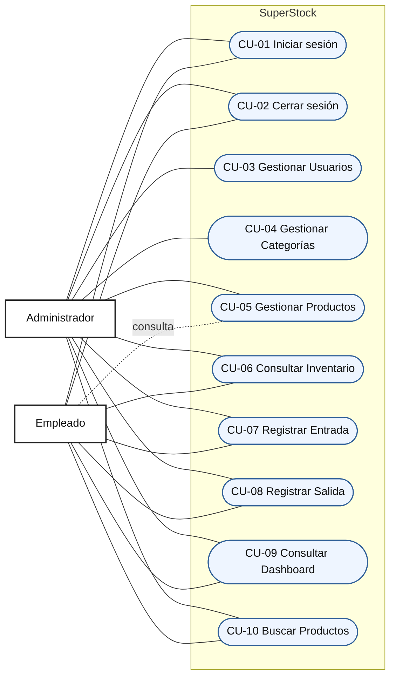

# Introducción

El presente documento especifica los casos de uso del Sistema Web de Gestión de Inventario para Supermercados **SuperStock**. Su contenido describe las interacciones funcionales entre los actores autorizados y el sistema, así como las condiciones que deben cumplirse para administrar datos maestros, registrar movimientos y consultar el estado del inventario.

La especificación adopta criterios de Ingeniería de Software y modelado UML. Cada caso de uso se relaciona de forma explícita con las reglas definidas en `06-ReglasNegocio.md`, con el fin de conservar la trazabilidad entre las necesidades funcionales, el diseño posterior y las pruebas del sistema.

SuperStock es una aplicación interna. En consecuencia, este documento no contempla comercio electrónico, catálogo público, carrito de compras, checkout, pagos ni pedidos mediante WhatsApp.

# Objetivo

Definir formalmente los casos de uso que delimitan el comportamiento funcional de SuperStock y las responsabilidades de sus actores.

La especificación servirá como base para:

- Validar el alcance funcional con las partes interesadas.
- Diseñar la base de datos y el Modelo Entidad-Relación.
- Identificar interfaces, validaciones y controles de acceso.
- Preparar criterios de aceptación y escenarios de prueba.
- Orientar el desarrollo posterior sin imponer una solución técnica específica.

# Alcance

El documento comprende exclusivamente los siguientes procesos:

- Autenticación y cierre de sesión.
- Administración de usuarios por parte del Administrador.
- Administración de categorías y productos.
- Consulta del inventario.
- Registro de entradas y salidas.
- Consulta del Dashboard.
- Búsqueda de productos.

El sistema reconoce únicamente dos actores: **Administrador** y **Empleado**. Ambos son usuarios internos autenticados, pero sus permisos son diferentes. El Administrador puede gestionar todos los módulos incluidos en el alcance. El Empleado puede consultar información y registrar movimientos, pero no puede administrar usuarios, alterar permisos ni modificar configuraciones del sistema.

No se incorporan casos de uso adicionales porque los diez casos definidos cubren los procesos requeridos. Las operaciones internas de crear, consultar, actualizar o desactivar registros se describen como variantes de los casos de gestión correspondientes.

# Actores del Sistema

| Actor | Descripción | Responsabilidades y permisos |
|---|---|---|
| **Administrador** | Usuario interno con privilegios administrativos y responsabilidad sobre la configuración funcional del inventario. | Iniciar y cerrar sesión; gestionar usuarios, categorías y productos; consultar inventario; registrar entradas y salidas; buscar productos; consultar el Dashboard. |
| **Empleado** | Usuario interno encargado de ejecutar y consultar operaciones cotidianas de inventario. | Iniciar y cerrar sesión; consultar el Dashboard, productos e inventario; buscar productos; registrar entradas y salidas. No puede administrar usuarios, permisos ni configuraciones. |

Los permisos de ambos actores se rigen por el principio de mínimo privilegio. La participación de un actor en un caso de uso no autoriza operaciones reservadas al otro actor.

# Diagrama General de Casos de Uso

La conexión discontinua del Empleado con CU-05 representa acceso exclusivamente de consulta. Las operaciones de creación, modificación y desactivación de productos permanecen reservadas al Administrador.

# Especificación detallada de cada Caso de Uso

## CU-01 — Iniciar sesión

| Campo | Especificación |
|---|---|
| **Código** | CU-01 |
| **Nombre** | Iniciar sesión |
| **Objetivo** | Autenticar a un usuario interno y habilitar únicamente las funciones correspondientes a su perfil. |
| **Actor principal** | Administrador o Empleado. |
| **Actores secundarios** | No aplica. |
| **Descripción** | El actor proporciona sus credenciales. El sistema valida la identidad, el estado de la cuenta y los permisos antes de crear una sesión. |

### Precondiciones

- El actor posee una cuenta registrada.
- La cuenta se encuentra activa y autorizada.
- El actor no mantiene una sesión autenticada vigente en la interacción actual.

### Flujo principal

1. El actor solicita acceder a SuperStock.
2. El sistema presenta el formulario de inicio de sesión.
3. El actor ingresa su identificador de acceso y contraseña.
4. El sistema valida que los datos obligatorios hayan sido proporcionados.
5. El sistema verifica las credenciales y el estado de la cuenta.
6. El sistema identifica el perfil del actor.
7. El sistema crea una sesión autenticada.
8. El sistema dirige al actor al Dashboard con las opciones permitidas para su perfil.

### Flujos alternativos

- **A1. Sesión ya iniciada:** si el actor ya posee una sesión válida, el sistema lo dirige al Dashboard sin solicitar nuevamente las credenciales.
- **A2. Corrección de datos:** si falta un dato obligatorio, el sistema solicita completarlo y conserva al actor en el formulario.

### Excepciones

- **E1. Credenciales inválidas:** el sistema rechaza el acceso y muestra un mensaje genérico que no identifica cuál dato fue incorrecto.
- **E2. Cuenta inactiva o bloqueada:** el sistema deniega el acceso y no crea la sesión.
- **E3. Fallo de validación:** el sistema no autentica al actor ni produce cambios parciales.

### Postcondiciones

- En caso de éxito, existe una sesión vigente asociada al usuario autenticado.
- El actor solo puede acceder a las funciones autorizadas para su perfil.
- En caso de fallo, no se crea ninguna sesión.

### Reglas de negocio relacionadas

RN-001, RN-002, RN-003, RN-005, RN-006, RN-008 y RN-009.

---

## CU-02 — Cerrar sesión

| Campo | Especificación |
|---|---|
| **Código** | CU-02 |
| **Nombre** | Cerrar sesión |
| **Objetivo** | Finalizar de forma segura la sesión activa del actor. |
| **Actor principal** | Administrador o Empleado. |
| **Actores secundarios** | No aplica. |
| **Descripción** | El actor solicita salir del sistema. SuperStock invalida su sesión y evita el uso posterior de la misma. |

### Precondiciones

- El actor mantiene una sesión autenticada vigente.

### Flujo principal

1. El actor selecciona la opción de cerrar sesión.
2. El sistema recibe la solicitud de finalización.
3. El sistema invalida la sesión activa.
4. El sistema elimina la posibilidad de reutilizar la sesión finalizada.
5. El sistema dirige al actor a la pantalla de inicio de sesión.

### Flujos alternativos

- **A1. Sesión expirada:** si la sesión ya expiró, el sistema dirige al actor a la pantalla de inicio de sesión.

### Excepciones

- **E1. Solicitud sin sesión válida:** el sistema no ejecuta operaciones sobre datos y presenta la pantalla de autenticación.

### Postcondiciones

- La sesión anterior queda invalidada.
- Cualquier nuevo acceso a funciones internas requiere autenticación.

### Reglas de negocio relacionadas

RN-002 y RN-007.

---

## CU-03 — Gestionar Usuarios

| Campo | Especificación |
|---|---|
| **Código** | CU-03 |
| **Nombre** | Gestionar Usuarios |
| **Objetivo** | Mantener las cuentas internas, sus datos, estado y permisos de acceso. |
| **Actor principal** | Administrador. |
| **Actores secundarios** | No aplica. |
| **Descripción** | El Administrador consulta usuarios y puede crear, actualizar, activar o desactivar cuentas de acuerdo con las políticas de acceso. |

### Precondiciones

- El Administrador ha iniciado sesión.
- La sesión está vigente.
- El Administrador posee permisos para gestionar usuarios.

### Flujo principal

1. El Administrador accede al módulo Usuarios.
2. El sistema presenta el listado de cuentas y su estado.
3. El Administrador selecciona crear, consultar, actualizar, activar o desactivar un usuario.
4. El sistema presenta la información correspondiente a la operación elegida.
5. El Administrador registra o modifica los datos y permisos permitidos.
6. El sistema valida obligatoriedad, formato y unicidad de la identidad de acceso.
7. El sistema solicita confirmación cuando la operación modifica el estado o los permisos.
8. El Administrador confirma la operación.
9. El sistema guarda el cambio y registra la trazabilidad de la acción.
10. El sistema informa el resultado y actualiza el listado.

### Flujos alternativos

- **A1. Consulta:** el Administrador revisa la información de una cuenta sin modificarla.
- **A2. Desactivación:** si el usuario posee movimientos históricos, el sistema conserva la cuenta y cambia únicamente su estado a inactivo.
- **A3. Cancelación:** el Administrador cancela antes de confirmar y el sistema no realiza cambios.

### Excepciones

- **E1. Identidad duplicada:** el sistema rechaza la creación o actualización cuando el correo o identificador ya pertenece a otra cuenta.
- **E2. Datos inválidos:** el sistema señala los errores y no guarda información parcial.
- **E3. Acceso de Empleado:** el sistema deniega el acceso al módulo y no muestra funciones administrativas.
- **E4. Pérdida de autorización:** si la sesión deja de ser válida o el Administrador pierde el permiso, el sistema rechaza la operación.

### Postcondiciones

- La cuenta queda creada o actualizada conforme a los datos validados; o permanece sin cambios si la operación no se completa.
- Los usuarios con historial conservan su identidad y referencias anteriores.
- La acción queda asociada al Administrador responsable.

### Reglas de negocio relacionadas

RN-002, RN-003, RN-004, RN-008, RN-009 y RN-010.

---

## CU-04 — Gestionar Categorías

| Campo | Especificación |
|---|---|
| **Código** | CU-04 |
| **Nombre** | Gestionar Categorías |
| **Objetivo** | Mantener la clasificación utilizada para organizar los productos del inventario. |
| **Actor principal** | Administrador. |
| **Actores secundarios** | No aplica. |
| **Descripción** | El Administrador consulta, crea, actualiza o elimina categorías, respetando la unicidad y las relaciones con productos. |

### Precondiciones

- El Administrador ha iniciado sesión.
- La sesión está vigente.
- El Administrador posee permisos sobre Categorías.

### Flujo principal

1. El Administrador accede al módulo Categorías.
2. El sistema presenta las categorías registradas.
3. El Administrador selecciona crear, consultar, actualizar o eliminar una categoría.
4. El sistema presenta la información requerida para la operación.
5. El Administrador ingresa o modifica los datos.
6. El sistema normaliza y valida el nombre de la categoría.
7. El sistema verifica que no exista otra categoría equivalente.
8. El Administrador confirma la operación.
9. El sistema guarda el cambio y registra su trazabilidad.
10. El sistema actualiza el listado e informa el resultado.

### Flujos alternativos

- **A1. Consulta:** el Administrador revisa una categoría sin modificarla.
- **A2. Eliminación sin asociaciones:** si la categoría no posee productos, el sistema solicita confirmación y permite eliminarla.
- **A3. Reasignación previa:** si existen productos asociados, el Administrador cancela la eliminación y procede a reasignarlos mediante la gestión de productos.
- **A4. Cancelación:** el Administrador abandona la operación y no se guardan cambios.

### Excepciones

- **E1. Categoría duplicada:** el sistema rechaza el registro o actualización.
- **E2. Categoría con productos asociados:** el sistema bloquea la eliminación y comunica que los productos deben ser reasignados o desactivados.
- **E3. Datos inválidos:** el sistema no guarda cambios parciales.
- **E4. Acceso no autorizado:** el sistema deniega la operación.

### Postcondiciones

- La categoría queda registrada, actualizada o eliminada únicamente si cumple las reglas aplicables.
- Ningún producto queda sin una categoría válida como consecuencia de la operación.
- La acción queda asociada al Administrador responsable.

### Reglas de negocio relacionadas

RN-002, RN-003, RN-004, RN-011, RN-012 y RN-013.

---

## CU-05 — Gestionar Productos

| Campo | Especificación |
|---|---|
| **Código** | CU-05 |
| **Nombre** | Gestionar Productos |
| **Objetivo** | Mantener el catálogo maestro interno de productos utilizados por el inventario. |
| **Actor principal** | Administrador. |
| **Actores secundarios** | Empleado, únicamente para consulta. |
| **Descripción** | El Administrador puede consultar, crear, actualizar, activar o desactivar productos. El Empleado puede visualizar el listado y el detalle, pero no modificarlo. |

### Precondiciones

- El actor ha iniciado sesión y mantiene una sesión vigente.
- Para modificar datos, el actor debe ser Administrador.
- Debe existir al menos una categoría válida para crear un producto.

### Flujo principal

1. El Administrador accede al módulo Productos.
2. El sistema presenta el listado de productos y su estado.
3. El Administrador selecciona crear, consultar, actualizar, activar o desactivar un producto.
4. El sistema presenta la información correspondiente.
5. El Administrador registra o modifica los datos maestros.
6. El sistema valida identificador interno, código de barras cuando aplique, categoría, unidad de control, estado y valores numéricos.
7. El sistema verifica la unicidad de los identificadores.
8. El Administrador confirma la operación.
9. El sistema guarda el cambio sin modificar directamente las existencias.
10. El sistema registra la trazabilidad e informa el resultado.

### Flujos alternativos

- **A1. Consulta por Empleado:** el Empleado accede al listado o detalle y el sistema presenta la información en modo de solo lectura.
- **A2. Desactivación con historial:** el sistema desactiva el producto y conserva sus movimientos anteriores.
- **A3. Reactivación:** el Administrador activa nuevamente un producto válido para permitir operaciones futuras.
- **A4. Cancelación:** el Administrador abandona el formulario y no se realizan cambios.

### Excepciones

- **E1. Identificador duplicado:** el sistema rechaza un SKU, código interno o código de barras ya asignado.
- **E2. Categoría inexistente o inválida:** el sistema no permite guardar el producto.
- **E3. Datos incompletos o valores inválidos:** el sistema informa los errores y no guarda datos parciales.
- **E4. Intento de modificar stock:** el sistema rechaza la modificación directa de existencias desde la ficha del producto.
- **E5. Modificación solicitada por Empleado:** el sistema deniega la acción.

### Postcondiciones

- El producto queda registrado o actualizado con una identificación única y una categoría válida.
- Una desactivación conserva el historial del producto.
- Las existencias permanecen inalteradas por la gestión de datos maestros.

### Reglas de negocio relacionadas

RN-002, RN-003, RN-004, RN-009, RN-012, RN-014, RN-015, RN-016, RN-017 y RN-019.

---

## CU-06 — Consultar Inventario

| Campo | Especificación |
|---|---|
| **Código** | CU-06 |
| **Nombre** | Consultar Inventario |
| **Objetivo** | Conocer las existencias y el estado de abastecimiento de los productos. |
| **Actor principal** | Administrador o Empleado. |
| **Actores secundarios** | No aplica. |
| **Descripción** | El actor consulta los saldos vigentes del inventario y puede filtrar la información sin modificar existencias. |

### Precondiciones

- El actor ha iniciado sesión.
- La sesión está vigente.
- El actor posee permiso de consulta de inventario.

### Flujo principal

1. El actor accede al módulo Inventario.
2. El sistema obtiene las existencias vigentes respaldadas por movimientos confirmados.
3. El sistema presenta cada producto con su identificación, categoría, existencia, stock mínimo y estado de abastecimiento.
4. El actor aplica criterios de búsqueda o filtrado cuando lo requiere.
5. El sistema actualiza los resultados según los criterios ingresados.
6. El actor selecciona un producto para consultar su información de inventario.
7. El sistema presenta el detalle disponible en modo de solo lectura.

### Flujos alternativos

- **A1. Sin filtros:** el sistema presenta el inventario completo permitido para el actor.
- **A2. Stock bajo o agotado:** el actor filtra productos cuya existencia sea menor o igual al mínimo, o igual a cero.
- **A3. Sin coincidencias:** el sistema informa que no existen registros para los criterios aplicados.

### Excepciones

- **E1. Sesión inválida:** el sistema interrumpe la consulta y solicita autenticación.
- **E2. Información no disponible:** el sistema comunica que no pudo obtener el inventario y no presenta saldos parciales como definitivos.
- **E3. Intento de edición directa:** el sistema no habilita modificaciones de stock desde la consulta.

### Postcondiciones

- No se modifica ningún saldo ni dato maestro.
- El actor obtiene una vista coherente del inventario disponible al momento de la consulta.

### Reglas de negocio relacionadas

RN-001, RN-002, RN-009, RN-012, RN-014, RN-018, RN-019, RN-020 y RN-021.

---

## CU-07 — Registrar Entrada

| Campo | Especificación |
|---|---|
| **Código** | CU-07 |
| **Nombre** | Registrar Entrada |
| **Objetivo** | Incrementar de forma controlada y trazable la existencia de un producto. |
| **Actor principal** | Administrador o Empleado. |
| **Actores secundarios** | No aplica. |
| **Descripción** | El actor registra el ingreso de unidades de un producto, indicando cantidad, fecha y referencia de origen. La confirmación crea el movimiento y actualiza el saldo como una única operación. |

### Precondiciones

- El actor ha iniciado sesión y posee permiso para registrar entradas.
- El producto existe y se encuentra activo.
- La unidad de control del producto está definida.

### Flujo principal

1. El actor accede al módulo Entradas.
2. El sistema presenta el formulario de registro.
3. El actor identifica o busca el producto.
4. El sistema presenta los datos básicos y la existencia actual del producto.
5. El actor ingresa la cantidad, fecha y motivo o referencia de origen.
6. El sistema valida que todos los datos obligatorios sean coherentes y que la cantidad sea mayor que cero.
7. El sistema presenta un resumen de la entrada.
8. El actor confirma el movimiento.
9. El sistema registra la entrada y aumenta la existencia exactamente en la cantidad indicada como una única operación.
10. El sistema asocia el movimiento con el actor y la fecha de ejecución.
11. El sistema informa el resultado y presenta la nueva existencia.

### Flujos alternativos

- **A1. Búsqueda de producto:** el actor utiliza CU-10 para localizar el producto antes de completar la entrada.
- **A2. Cantidad fraccionaria permitida:** el sistema acepta decimales únicamente cuando la unidad de control del producto lo permite.
- **A3. Cancelación antes de confirmar:** el actor cancela y el sistema no registra el movimiento ni altera el stock.

### Excepciones

- **E1. Producto inexistente o inactivo:** el sistema rechaza la entrada.
- **E2. Cantidad inválida:** el sistema solicita una cantidad mayor que cero y compatible con la unidad de control.
- **E3. Datos incompletos:** el sistema informa los campos requeridos y no actualiza existencias.
- **E4. Fallo durante la confirmación:** el sistema revierte la operación completa; no debe existir movimiento sin incremento ni incremento sin movimiento.
- **E5. Permiso insuficiente:** el sistema deniega el registro.

### Postcondiciones

- Se conserva un movimiento de entrada confirmado y asociado al actor.
- La existencia aumenta exactamente en la cantidad registrada.
- El movimiento confirmado queda protegido contra eliminación o alteración de producto y cantidad.
- Si la operación falla o se cancela, la existencia permanece sin cambios.

### Reglas de negocio relacionadas

RN-002, RN-003, RN-004, RN-009, RN-014, RN-016, RN-017, RN-018, RN-019, RN-022, RN-023 y RN-024.

---

## CU-08 — Registrar Salida

| Campo | Especificación |
|---|---|
| **Código** | CU-08 |
| **Nombre** | Registrar Salida |
| **Objetivo** | Disminuir de forma controlada y trazable la existencia de un producto sin generar saldos negativos. |
| **Actor principal** | Administrador o Empleado. |
| **Actores secundarios** | No aplica. |
| **Descripción** | El actor registra la salida de unidades de un producto, especificando cantidad, fecha y motivo o destino. El sistema verifica la disponibilidad antes de confirmar. |

### Precondiciones

- El actor ha iniciado sesión y posee permiso para registrar salidas.
- El producto existe y se encuentra activo.
- El producto posee existencia disponible mayor que cero.
- La unidad de control del producto está definida.

### Flujo principal

1. El actor accede al módulo Salidas.
2. El sistema presenta el formulario de registro.
3. El actor identifica o busca el producto.
4. El sistema presenta los datos básicos y la existencia disponible.
5. El actor ingresa la cantidad, fecha y motivo o destino de la salida.
6. El sistema valida los datos obligatorios y la compatibilidad de la cantidad con la unidad de control.
7. El sistema verifica que la cantidad sea mayor que cero y no supere la existencia disponible.
8. El sistema presenta un resumen del movimiento y el saldo resultante.
9. El actor confirma la salida.
10. El sistema registra el movimiento y reduce la existencia exactamente en la cantidad indicada como una única operación.
11. El sistema asocia el movimiento con el actor y la fecha de ejecución.
12. El sistema informa el resultado y presenta la nueva existencia.

### Flujos alternativos

- **A1. Búsqueda de producto:** el actor utiliza CU-10 para localizar el producto.
- **A2. Cantidad fraccionaria permitida:** el sistema acepta decimales únicamente cuando la unidad de control lo permite.
- **A3. Cancelación antes de confirmar:** el sistema descarta la operación y conserva la existencia original.

### Excepciones

- **E1. Stock insuficiente:** el sistema rechaza la salida e informa la existencia disponible.
- **E2. Producto inexistente o inactivo:** el sistema no permite continuar.
- **E3. Cantidad inválida:** el sistema solicita una cantidad válida y no modifica el inventario.
- **E4. Datos incompletos:** el sistema informa los campos requeridos.
- **E5. Cambio concurrente de disponibilidad:** si la existencia disminuye antes de confirmar, el sistema vuelve a validar y rechaza la operación cuando el saldo resulte insuficiente.
- **E6. Fallo durante la confirmación:** el sistema revierte la operación completa; no debe existir salida sin disminución ni disminución sin movimiento.
- **E7. Permiso insuficiente:** el sistema deniega el registro.

### Postcondiciones

- Se conserva un movimiento de salida confirmado y asociado al actor.
- La existencia disminuye exactamente en la cantidad registrada y nunca queda por debajo de cero.
- El movimiento confirmado queda protegido contra eliminación o alteración de producto y cantidad.
- Si la operación falla o se cancela, la existencia permanece sin cambios.

### Reglas de negocio relacionadas

RN-002, RN-003, RN-004, RN-009, RN-014, RN-016, RN-017, RN-018, RN-019, RN-020, RN-025, RN-026 y RN-027.

---

## CU-09 — Consultar Dashboard

| Campo | Especificación |
|---|---|
| **Código** | CU-09 |
| **Nombre** | Consultar Dashboard |
| **Objetivo** | Proporcionar una visión resumida y real del estado operativo del inventario. |
| **Actor principal** | Administrador o Empleado. |
| **Actores secundarios** | No aplica. |
| **Descripción** | El actor consulta indicadores consolidados de productos, existencias y movimientos recientes, sin modificar información desde el Dashboard. |

### Precondiciones

- El actor ha iniciado sesión.
- La sesión está vigente.
- El actor posee permiso de consulta del Dashboard.

### Flujo principal

1. El actor accede al Dashboard.
2. El sistema obtiene información vigente de Productos, Inventario, Entradas y Salidas.
3. El sistema calcula los indicadores requeridos.
4. El sistema presenta el total de productos registrados y activos.
5. El sistema presenta los productos con stock bajo o agotado.
6. El sistema presenta un resumen de entradas y salidas recientes.
7. El actor consulta los indicadores y utiliza los accesos permitidos para navegar a otros módulos.

### Flujos alternativos

- **A1. Sin movimientos recientes:** el sistema informa que no existe actividad reciente, sin sustituirla por datos simulados.
- **A2. Sin productos en condición crítica:** el sistema indica que no existen productos con stock bajo o agotado.
- **A3. Vista según perfil:** el sistema muestra únicamente accesos y datos permitidos para el actor autenticado.

### Excepciones

- **E1. Datos no disponibles:** el sistema comunica que no pudo calcular uno o más indicadores y evita presentar valores ficticios o desactualizados como definitivos.
- **E2. Intento de modificación:** el sistema no permite cambiar existencias desde el Dashboard.
- **E3. Sesión inválida:** el sistema solicita autenticación.

### Postcondiciones

- No se modifica ningún dato del sistema.
- El actor obtiene indicadores derivados de información real y vigente.

### Reglas de negocio relacionadas

RN-001, RN-002, RN-009, RN-021, RN-028, RN-029 y RN-030.

---

## CU-10 — Buscar Productos

| Campo | Especificación |
|---|---|
| **Código** | CU-10 |
| **Nombre** | Buscar Productos |
| **Objetivo** | Localizar de forma precisa productos registrados para su consulta o selección en operaciones autorizadas. |
| **Actor principal** | Administrador o Empleado. |
| **Actores secundarios** | No aplica. |
| **Descripción** | El actor ingresa uno o más criterios y el sistema presenta los productos coincidentes, respetando los permisos y el contexto desde el cual se realizó la búsqueda. |

### Precondiciones

- El actor ha iniciado sesión.
- La sesión está vigente.
- El actor posee acceso al módulo desde el cual ejecuta la búsqueda.

### Flujo principal

1. El actor accede a una función que permite buscar productos.
2. El sistema presenta los criterios de búsqueda disponibles.
3. El actor ingresa un nombre, código interno, SKU, código de barras o categoría.
4. El sistema valida y normaliza los criterios ingresados.
5. El sistema localiza los productos coincidentes.
6. El sistema presenta los resultados con identificación, nombre, categoría, estado y datos de inventario permitidos.
7. El actor selecciona un producto para consultarlo o utilizarlo en una operación autorizada.

### Flujos alternativos

- **A1. Búsqueda parcial:** el sistema presenta coincidencias por una parte válida del nombre o identificador.
- **A2. Filtro por categoría:** el sistema limita los resultados a la categoría seleccionada.
- **A3. Sin criterio:** cuando el contexto lo permita, el sistema presenta el listado inicial de productos.
- **A4. Producto inactivo:** en consultas administrativas, el sistema puede mostrarlo identificado como inactivo; no podrá seleccionarse para nuevos movimientos.

### Excepciones

- **E1. Sin coincidencias:** el sistema informa que no se encontraron productos y permite modificar los criterios.
- **E2. Criterio inválido:** el sistema solicita corregirlo y no ejecuta una búsqueda inconsistente.
- **E3. Producto no autorizado para la operación:** el sistema permite su consulta cuando corresponda, pero impide seleccionarlo para una entrada o salida.
- **E4. Sesión inválida:** el sistema interrumpe la búsqueda y solicita autenticación.

### Postcondiciones

- No se modifica información del producto ni del inventario.
- El actor obtiene resultados acordes con sus criterios, permisos y contexto operativo.

### Reglas de negocio relacionadas

RN-001, RN-002, RN-009, RN-011, RN-012, RN-014, RN-015 y RN-017.

# Trazabilidad

| Caso de Uso | Reglas de Negocio relacionadas | Módulo del Sistema |
|---|---|---|
| **CU-01 Iniciar sesión** | RN-001, RN-002, RN-003, RN-005, RN-006, RN-008, RN-009 | Login, Usuarios |
| **CU-02 Cerrar sesión** | RN-002, RN-007 | Login |
| **CU-03 Gestionar Usuarios** | RN-002, RN-003, RN-004, RN-008, RN-009, RN-010 | Usuarios |
| **CU-04 Gestionar Categorías** | RN-002, RN-003, RN-004, RN-011, RN-012, RN-013 | Categorías |
| **CU-05 Gestionar Productos** | RN-002, RN-003, RN-004, RN-009, RN-012, RN-014, RN-015, RN-016, RN-017, RN-019 | Productos |
| **CU-06 Consultar Inventario** | RN-001, RN-002, RN-009, RN-012, RN-014, RN-018, RN-019, RN-020, RN-021 | Inventario |
| **CU-07 Registrar Entrada** | RN-002, RN-003, RN-004, RN-009, RN-014, RN-016, RN-017, RN-018, RN-019, RN-022, RN-023, RN-024 | Entradas, Inventario |
| **CU-08 Registrar Salida** | RN-002, RN-003, RN-004, RN-009, RN-014, RN-016, RN-017, RN-018, RN-019, RN-020, RN-025, RN-026, RN-027 | Salidas, Inventario |
| **CU-09 Consultar Dashboard** | RN-001, RN-002, RN-009, RN-021, RN-028, RN-029, RN-030 | Dashboard |
| **CU-10 Buscar Productos** | RN-001, RN-002, RN-009, RN-011, RN-012, RN-014, RN-015, RN-017 | Productos |

Esta matriz deberá mantenerse actualizada si una regla de negocio cambia. La modificación de un caso de uso deberá evaluarse también sobre el módulo relacionado, el diseño de datos, los criterios de aceptación y las pruebas derivadas.
