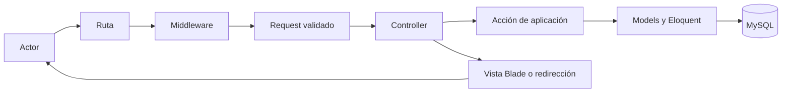

# Arquitectura de SuperStock

## 1. Propósito

Este documento define la arquitectura objetivo de SuperStock. Describe estructura, responsabilidades, dependencias y decisiones técnicas; el comportamiento funcional reside en `requerimientos.md`, `casos_de_uso.md` y `modulos/`, mientras el modelo de persistencia reside en `base_datos.md`.

## 2. Estilo arquitectónico

SuperStock se implementará como un **monolito modular basado en MVC** sobre Laravel.

- **Monolito:** una aplicación desplegable y una base de datos principal.
- **Modular:** cada área funcional mantiene límites, nombres y responsabilidades explícitas.
- **MVC:** separa presentación, coordinación de solicitudes y persistencia del dominio.

Este enfoque es suficiente para el alcance académico, reduce complejidad operativa y permite reutilizar la infraestructura de SnackConnect sin conservar su dominio comercial.

## 3. Stack tecnológico objetivo

| Componente | Decisión |
|---|---|
| Lenguaje | PHP 8.2 o superior |
| Framework | Laravel 12.x |
| Persistencia | MySQL, con versión uniforme en desarrollo, pruebas y presentación |
| ORM | Eloquent |
| Presentación | Blade |
| Estilos | Tailwind CSS y estilos propios gobernados por `design/` |
| JavaScript | JavaScript modular para interacción progresiva |
| Assets | Vite |
| Pruebas | PHPUnit mediante la infraestructura de Laravel |

MariaDB no se asumirá equivalente al destino sin una verificación de compatibilidad. El motor oficial debe fijarse antes de implementar la transformación de datos.

## 4. Capas y responsabilidades

### 4.1 Rutas

- Declaran endpoints y métodos HTTP.
- Agrupan middleware de autenticación y autorización.
- No contienen lógica de negocio ni consultas.
- Utilizan nombres consistentes por módulo.

### 4.2 Middleware

- Verifica sesión autenticada.
- Restringe acciones administrativas.
- Diferencia permisos de Administrador y Empleado.
- No sustituye la autorización de operaciones específicas.

### 4.3 Controllers

- Reciben solicitudes validadas.
- Coordinan casos de uso y respuestas.
- Delegan reglas complejas de inventario a servicios o acciones cohesionadas.
- No concentran validación repetida ni cálculos críticos de stock.

### 4.4 Requests

- Centralizan obligatoriedad, formato, dominio y mensajes de validación.
- Aplican autorización preliminar cuando corresponda.
- Evitan reglas duplicadas entre creación y actualización.

### 4.5 Servicios o acciones de aplicación

Las operaciones que combinan movimiento y saldo deberán encapsularse como acciones transaccionales reutilizables:

- Registrar entrada.
- Registrar salida.
- Registrar movimiento compensatorio.

Su responsabilidad es volver a validar disponibilidad, bloquear el saldo afectado cuando sea necesario y garantizar que movimiento y existencia se confirmen o reviertan juntos.

### 4.6 Models

- Representan las seis entidades aprobadas.
- Declaran relaciones, conversiones y consultas reutilizables.
- Protegen asignación de atributos.
- No mezclan etiquetas de interfaz con reglas críticas de persistencia.

### 4.7 Views

- Presentan información ya preparada.
- Escapan datos por defecto.
- Reutilizan layouts y componentes del sistema de diseño.
- No ejecutan consultas ni deciden permisos críticos.

### 4.8 Base de datos

- Garantiza llaves, unicidad e integridad referencial.
- Mantiene `products`, `inventories` e `inventory_movements` separados.
- Conserva movimientos históricos.
- Apoya, pero no reemplaza, la validación de aplicación.

## 5. Módulos y dependencias

| Módulo | Responsabilidad | Dependencias permitidas |
|---|---|---|
| Autenticación | Login, logout y sesión | Usuarios |
| Usuarios | Cuentas, roles y estado | Autenticación, Movimientos para conservación histórica |
| Categorías | Clasificación | Productos para validar asociaciones |
| Productos | Catálogo maestro y búsqueda | Categorías, Inventario |
| Proveedores | Maestro de abastecedores | Entradas y Movimientos |
| Inventario y Movimientos | Saldo, mínimo e historial | Productos, Usuarios, Proveedores |
| Entradas | Incremento trazable | Productos, Inventario, Movimientos, Proveedores, Usuarios |
| Salidas | Disminución trazable | Productos, Inventario, Movimientos, Usuarios |
| Dashboard | Indicadores de consulta | Productos, Inventario, Movimientos |

Los módulos no deben depender de elementos eliminados de SnackConnect. Dashboard es consumidor de datos y no modifica existencias.

## 6. Flujo de una solicitud

Para consultas simples, el Controller puede utilizar consultas cohesionadas de los Models sin una acción adicional. Para entradas, salidas y compensaciones, la acción transaccional es obligatoria.

## 7. Seguridad

### 7.1 Autenticación

- Acceso mediante correo y contraseña protegida.
- Solo cuentas activas.
- Regeneración de sesión después del login.
- Invalidación de sesión y token al cerrar.
- Sin registro público.

### 7.2 Autorización

- Administrador: mantenimiento de usuarios, categorías, productos y proveedores.
- Empleado: consulta y registro de entradas y salidas.
- Ambos: Dashboard, búsqueda, inventario e historial autorizado.
- La interfaz oculta acciones no disponibles, pero el servidor siempre vuelve a autorizarlas.

### 7.3 Protección de solicitudes y datos

- Protección CSRF en formularios mutables.
- Escape de salida en Blade.
- Validación de todos los identificadores relacionados.
- Mensajes de autenticación no reveladores.
- Limitación de intentos en operaciones sensibles.

## 8. Consistencia de inventario

- El stock no se recibe como valor editable del producto.
- Una entrada o salida opera sobre el inventario del producto dentro de una transacción.
- Antes de una salida se consulta nuevamente la existencia disponible.
- Las operaciones concurrentes sobre el mismo saldo deben serializar su modificación.
- Una salida insuficiente se rechaza sin crear movimiento.
- Un movimiento confirmado no se actualiza ni elimina.
- Una corrección crea un nuevo movimiento compensatorio.
- El saldo debe conciliarse con entradas menos salidas.

## 9. Estrategia de rutas

### Públicas

- Login.
- Recuperación de acceso solo si se aprueba dentro del alcance futuro.

### Autenticadas

- Logout.
- Dashboard.
- Búsqueda y consulta de productos.
- Inventario y movimientos.
- Entradas y salidas.

### Administrativas

- Usuarios.
- Categorías.
- Mantenimiento de productos.
- Proveedores.

No existirán rutas de catálogo público, carrito, checkout, pedidos, clientes, WhatsApp ni registro público.

## 10. Presentación y assets

- Un layout de autenticación y un layout interno compartido.
- Navegación lateral adaptada al rol.
- Componentes Blade para tablas, filtros, badges, alertas, paginación y estados vacíos.
- JavaScript limitado a mejorar interacción; el flujo debe seguir siendo verificable desde el servidor.
- La identidad y los tokens se definen únicamente en `design/branding.md` y `design/design-system.md`.

## 11. Manejo de errores y observabilidad

- Los errores de validación regresan al formulario con mensajes accionables.
- Los errores de autorización no revelan información protegida.
- Una falla transaccional no deja cambios parciales.
- Los errores inesperados se registran con contexto técnico, sin exponerlo al usuario.
- Los movimientos conservan trazabilidad funcional; los logs técnicos no sustituyen dicha trazabilidad.

## 12. Estrategia de pruebas

- **Unitarias:** reglas y cálculos aislables.
- **Feature:** casos de uso, permisos, validación y persistencia.
- **Integración:** restricciones y transacciones sobre el motor oficial.
- **Concurrencia:** salidas simultáneas sobre el mismo producto.
- **Regresión:** ausencia de rutas y dependencias del dominio SnackConnect.
- **Interfaz:** responsive, accesibilidad y visibilidad según rol.

## 13. Decisiones arquitectónicas

| Decisión | Justificación |
|---|---|
| Monolito modular | Minimiza despliegue y conserva límites funcionales claros. |
| MVC con acciones transaccionales | Reutiliza Laravel y evita controladores con lógica crítica excesiva. |
| Un inventario por producto en V1 | Corresponde al alcance sin sucursales ni bodegas múltiples. |
| Movimiento y saldo separados | Permite consulta rápida y trazabilidad histórica. |
| Sin API pública en V1 | La interfaz Blade cubre los actores internos aprobados. |
| Sin paquetes de permisos obligatorios | Dos roles pueden resolverse con autorización nativa; se reevaluará si crecen los perfiles. |
| Sin eliminación destructiva de históricos | Protege auditoría e integridad referencial. |

## 14. Restricciones

- Solo se implementan las seis entidades del MER.
- No se incorporan ventas, compras, facturación ni ubicaciones múltiples.
- La adaptación no reutiliza lógica de pedidos para simular movimientos.
- Las métricas se calculan con datos reales.
- Toda ampliación requiere actualizar primero la fuente oficial `spec/`.

