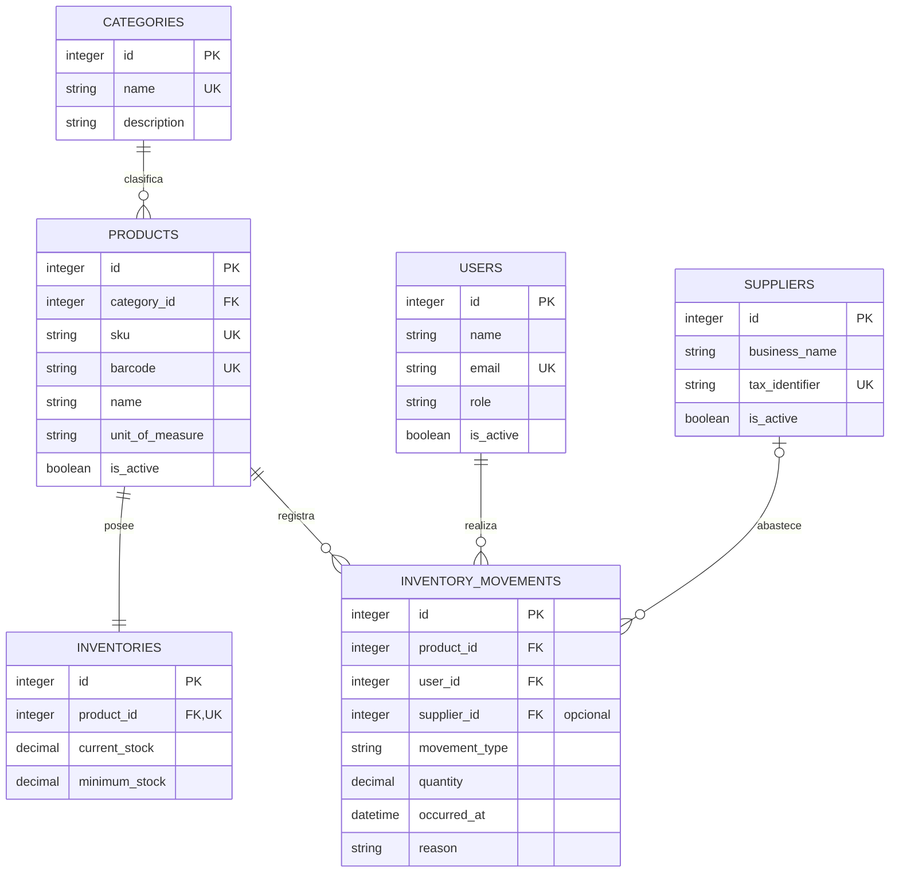

# Diseño de Base de Datos de SuperStock

## 1. Propósito y alcance

Este documento es la especificación oficial del modelo conceptual y lógico de datos. Consolida el MER, atributos, relaciones, cardinalidades e integridad; no define migraciones ni scripts SQL.

El modelo funcional contiene exclusivamente seis entidades:

1. `users`
2. `categories`
3. `products`
4. `suppliers`
5. `inventories`
6. `inventory_movements`

Las tablas técnicas de Laravel no forman parte del modelo de negocio.

## 2. Principios de diseño

- **Simplicidad:** solo entidades justificadas por requisitos y casos de uso.
- **3FN:** datos descriptivos almacenados una sola vez en su entidad.
- **Integridad referencial:** ninguna relación obligatoria admite registros huérfanos.
- **Trazabilidad:** cada variación de stock conserva un movimiento y responsable.
- **Separación:** producto, saldo e historial son responsabilidades diferentes.
- **Conservación:** registros con historia se desactivan, no se destruyen.
- **Escalabilidad:** Inventario permanece separado para admitir ubicaciones futuras.

## 3. Entidades

### 3.1 users

Almacena cuentas internas, credenciales protegidas, rol y estado. Los roles son Administrador y Empleado. Un usuario puede ser responsable de muchos movimientos.

### 3.2 categories

Almacena clasificaciones únicas. Cada producto pertenece obligatoriamente a una categoría; una categoría puede no tener productos todavía.

### 3.3 products

Almacena el catálogo maestro: categoría, SKU, código de barras opcional, nombre, descripción, unidad y estado. No almacena existencias.

### 3.4 suppliers

Almacena proveedores que pueden relacionarse opcionalmente con entradas. Sus datos no se duplican en cada movimiento.

### 3.5 inventories

Almacena la existencia vigente y el stock mínimo. En la primera versión existe exactamente un inventario por producto.

### 3.6 inventory_movements

Almacena entradas y salidas inmutables con producto, usuario, proveedor opcional, cantidad, fecha, motivo y referencia.

## 4. Modelo lógico y diccionario

Los tipos son sugerencias lógicas orientadas a MySQL y deberán confirmarse en el diseño físico.

### 4.1 users

| Campo | Tipo sugerido | Obligatorio | Clave | Restricciones y propósito |
|---|---|:---:|---|---|
| `id` | Entero grande positivo | Sí | PK | Identificador estable generado por el sistema. |
| `name` | Cadena, 150 | Sí | — | Nombre completo no vacío. |
| `email` | Cadena, 255 | Sí | UK | Correo válido, normalizado y único. |
| `password` | Cadena, 255 | Sí | — | Contraseña protegida; nunca texto legible. |
| `role` | Cadena controlada, 20 | Sí | — | `Administrador` o `Empleado`. |
| `is_active` | Booleano | Sí | — | Solo una cuenta activa inicia sesión. |
| `created_at` | Fecha y hora | Sí | — | Creación del registro. |
| `updated_at` | Fecha y hora | Sí | — | Última actualización. |

### 4.2 categories

| Campo | Tipo sugerido | Obligatorio | Clave | Restricciones y propósito |
|---|---|:---:|---|---|
| `id` | Entero grande positivo | Sí | PK | Identificador estable. |
| `name` | Cadena, 120 | Sí | UK | Nombre único después de normalización. |
| `description` | Cadena, 500 | No | — | Descripción breve de la clasificación. |
| `created_at` | Fecha y hora | Sí | — | Creación del registro. |
| `updated_at` | Fecha y hora | Sí | — | Última actualización. |

### 4.3 products

| Campo | Tipo sugerido | Obligatorio | Clave | Restricciones y propósito |
|---|---|:---:|---|---|
| `id` | Entero grande positivo | Sí | PK | Identificador estable. |
| `category_id` | Entero grande positivo | Sí | FK | Categoría existente. |
| `sku` | Cadena, 60 | Sí | UK | Código interno único. |
| `barcode` | Cadena, 50 | No | UK | Único cuando existe; texto para conservar ceros. |
| `name` | Cadena, 180 | Sí | — | Nombre no vacío. |
| `description` | Texto | No | — | Información descriptiva sin stock. |
| `unit_of_measure` | Cadena controlada, 30 | Sí | — | Define unidad y admisión de fracciones. |
| `is_active` | Booleano | Sí | — | Un producto inactivo no admite movimientos nuevos. |
| `created_at` | Fecha y hora | Sí | — | Creación del registro. |
| `updated_at` | Fecha y hora | Sí | — | Última actualización. |

### 4.4 suppliers

| Campo | Tipo sugerido | Obligatorio | Clave | Restricciones y propósito |
|---|---|:---:|---|---|
| `id` | Entero grande positivo | Sí | PK | Identificador estable. |
| `business_name` | Cadena, 180 | Sí | — | Nombre o razón social. |
| `tax_identifier` | Cadena, 30 | No | UK | Único cuando existe. |
| `contact_name` | Cadena, 150 | No | — | Contacto principal. |
| `phone` | Cadena, 30 | No | — | Teléfono de contacto. |
| `email` | Cadena, 255 | No | — | Correo válido cuando existe. |
| `is_active` | Booleano | Sí | — | Solo proveedores activos se seleccionan en nuevas entradas. |
| `created_at` | Fecha y hora | Sí | — | Creación del registro. |
| `updated_at` | Fecha y hora | Sí | — | Última actualización. |

### 4.5 inventories

| Campo | Tipo sugerido | Obligatorio | Clave | Restricciones y propósito |
|---|---|:---:|---|---|
| `id` | Entero grande positivo | Sí | PK | Identificador estable. |
| `product_id` | Entero grande positivo | Sí | FK, UK | Garantiza un inventario por producto en V1. |
| `current_stock` | Decimal, precisión 14 escala 3 | Sí | — | Mayor o igual a cero; inicia en cero. |
| `minimum_stock` | Decimal, precisión 14 escala 3 | Sí | — | Mayor o igual a cero; umbral de stock bajo. |
| `created_at` | Fecha y hora | Sí | — | Creación del saldo. |
| `updated_at` | Fecha y hora | Sí | — | Última variación o cambio del mínimo. |

### 4.6 inventory_movements

| Campo | Tipo sugerido | Obligatorio | Clave | Restricciones y propósito |
|---|---|:---:|---|---|
| `id` | Entero grande positivo | Sí | PK | Identificador estable e inmutable. |
| `product_id` | Entero grande positivo | Sí | FK | Producto afectado. |
| `user_id` | Entero grande positivo | Sí | FK | Responsable del movimiento. |
| `supplier_id` | Entero grande positivo | No | FK | Proveedor opcional para entradas; ausente en salidas. |
| `movement_type` | Cadena controlada, 10 | Sí | — | `Entrada` o `Salida`. |
| `quantity` | Decimal, precisión 14 escala 3 | Sí | — | Mayor que cero y compatible con la unidad. |
| `occurred_at` | Fecha y hora | Sí | — | Fecha efectiva de la operación. |
| `reason` | Cadena, 255 | Sí | — | Origen, motivo o destino no vacío. |
| `reference` | Cadena, 100 | No | — | Referencia documental o administrativa. |
| `created_at` | Fecha y hora | Sí | — | Confirmación en el sistema. |

Los movimientos no requieren `updated_at` porque sus datos esenciales son inmutables.

## 5. Relaciones y cardinalidades

| Entidad A | Entidad B | Cardinalidad | Participación |
|---|---|---|---|
| `categories` | `products` | 1:N | Categoría 0..N productos; producto exactamente 1 categoría. |
| `products` | `inventories` | 1:1 | Ambos extremos obligatorios para productos controlados. |
| `products` | `inventory_movements` | 1:N | Producto 0..N movimientos; movimiento exactamente 1 producto. |
| `users` | `inventory_movements` | 1:N | Usuario 0..N movimientos; movimiento exactamente 1 usuario. |
| `suppliers` | `inventory_movements` | 1:N opcional | Proveedor 0..N movimientos; movimiento 0..1 proveedor. |

No se agrega una relación directa `inventories`—`inventory_movements`: ambas se coordinan mediante el producto, conforme al MER aprobado.

## 6. Diagrama MER

## 7. Integridad

### 7.1 Entidad

- Todas las PK son obligatorias, únicas, estables y no reutilizables.
- La identidad de movimientos históricos no cambia.

### 7.2 Referencial

- Todo producto referencia una categoría existente.
- Todo inventario referencia un producto único.
- Todo movimiento referencia producto y usuario existentes.
- El proveedor es opcional; cuando existe debe ser válido.
- No se utilizan eliminaciones en cascada que destruyan movimientos.

### 7.3 Unicidad

- `users.email`.
- `categories.name` normalizado.
- `products.sku`.
- `products.barcode` cuando existe.
- `suppliers.tax_identifier` cuando existe.
- `inventories.product_id` en la primera versión.

### 7.4 Dominio

- Rol: Administrador o Empleado.
- Movimiento: Entrada o Salida.
- Cantidad de movimiento mayor que cero.
- Stock actual y mínimo no negativos.
- Fracciones según unidad del producto.
- Estados booleanos válidos.

### 7.5 Negocio

- Stock solo cambia mediante movimientos confirmados.
- Entrada incrementa exactamente; salida disminuye exactamente.
- Una salida nunca supera disponibilidad.
- Movimiento y saldo se confirman o revierten juntos.
- Movimientos confirmados no se modifican ni eliminan.
- Correcciones mediante movimientos compensatorios.

## 8. Coherencia del saldo

**Existencia vigente = total de entradas confirmadas − total de salidas confirmadas**

`inventories.current_stock` es un saldo materializado para consulta inmediata. `inventory_movements` es el historial auditable. El almacenamiento del saldo no autoriza edición directa.

## 9. Normalización

### 1FN

- Atributos atómicos.
- Sin listas ni grupos repetitivos.
- Cada movimiento representa un producto y un tipo.

### 2FN

- Todas las PK son simples.
- Cada atributo no clave depende de la identidad completa de su entidad.

### 3FN

- Productos no duplican datos de categoría.
- Movimientos no duplican nombres de producto, usuario o proveedor.
- Inventarios no duplican atributos maestros del producto.
- Existencias no se almacenan en productos.

El saldo materializado es una decisión operativa controlada y conciliable, no una dependencia transitiva dentro de `inventories`.

## 10. Políticas de conservación

- Usuario con movimientos: desactivar.
- Producto con movimientos: desactivar.
- Proveedor con movimientos: desactivar.
- Categoría con productos: restringir eliminación.
- Movimiento confirmado: conservar permanentemente.

## 11. Escalabilidad

Una versión futura puede incorporar ubicaciones y cambiar la unicidad del inventario a producto por ubicación. La responsabilidad de las entidades actuales se mantiene:

- Producto describe el artículo.
- Inventario representa un saldo por contexto.
- Movimiento explica variaciones y ubicación afectada.

Sucursales y bodegas no forman parte del modelo actual y requieren actualización previa de `spec/`.

## 12. Decisiones excluidas del modelo

- Sin tablas de clientes, pedidos, ventas o pagos.
- Sin órdenes de compra.
- Sin precios ni imágenes en el modelo aprobado de producto.
- Sin tabla independiente de roles o tipos de movimiento en V1.
- Sin relación directa Inventario—Movimiento.
- Sin tablas técnicas del framework como entidades funcionales.

