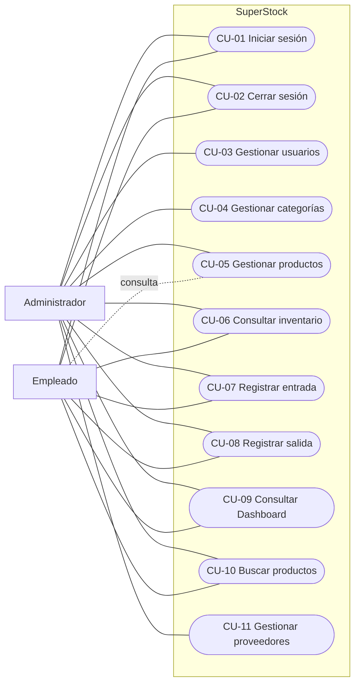

# Casos de Uso de SuperStock

## 1. Propósito

Este documento define las interacciones oficiales entre Administrador, Empleado y SuperStock. Los requisitos y reglas citados se encuentran en [requerimientos.md](requerimientos.md).

CU-11 se incorpora porque la entidad y el módulo Proveedores forman parte del alcance aprobado y requieren un mecanismo administrativo mínimo. No se añaden otros casos de uso.

## 2. Actores

- **Administrador:** ejecuta todos los casos de uso.
- **Empleado:** ejecuta CU-01, CU-02, CU-05 en modo consulta, CU-06, CU-07, CU-08, CU-09 y CU-10.

## 3. Diagrama general

## 4. Especificaciones

### CU-01 — Iniciar sesión

- **Objetivo:** autenticar un usuario interno y habilitar sus funciones autorizadas.
- **Actor principal:** Administrador o Empleado.
- **Precondiciones:** cuenta registrada y activa; no existe sesión vigente en la interacción.
- **Flujo principal:** el actor abre el login, ingresa correo y contraseña; el sistema valida datos, credenciales y estado, regenera la sesión e ingresa al Dashboard según el rol.
- **Alternativas y excepciones:** una sesión vigente redirige al Dashboard; datos faltantes se corrigen; credenciales inválidas o cuenta inactiva deniegan el acceso sin revelar información sensible.
- **Postcondiciones:** existe una sesión asociada al usuario y limitada por sus permisos; en caso de error no se crea sesión.
- **Trazabilidad:** RF-001, RF-013; RN-001, RN-002, RN-005, RN-006, RN-008, RN-009.

### CU-02 — Cerrar sesión

- **Objetivo:** finalizar de manera segura la sesión activa.
- **Actor principal:** Administrador o Empleado.
- **Precondiciones:** sesión autenticada vigente.
- **Flujo principal:** el actor solicita salir; el sistema invalida sesión y token y muestra el login.
- **Alternativas y excepciones:** si la sesión ya expiró, se presenta directamente el login.
- **Postcondiciones:** las áreas internas vuelven a exigir autenticación.
- **Trazabilidad:** RF-002; RN-002, RN-007.

### CU-03 — Gestionar usuarios

- **Objetivo:** mantener cuentas internas, roles y estados.
- **Actor principal:** Administrador.
- **Precondiciones:** sesión de Administrador vigente.
- **Flujo principal:** consulta el listado; elige crear, editar, activar o desactivar; registra datos y rol; el sistema valida unicidad y guarda la acción trazable.
- **Alternativas y excepciones:** puede consultar o cancelar sin cambios; un usuario con historial solo se desactiva; correo duplicado o datos inválidos se rechazan; el Empleado recibe acceso denegado.
- **Postcondiciones:** la cuenta queda actualizada sin romper referencias históricas.
- **Trazabilidad:** RF-003, RF-013; RN-003, RN-004, RN-008, RN-009, RN-010.

### CU-04 — Gestionar categorías

- **Objetivo:** mantener clasificaciones únicas para los productos.
- **Actor principal:** Administrador.
- **Precondiciones:** sesión de Administrador vigente.
- **Flujo principal:** consulta categorías; crea o edita nombre y descripción; el sistema normaliza, valida unicidad y registra la acción.
- **Alternativas y excepciones:** una categoría sin productos puede eliminarse con confirmación; si tiene productos, la eliminación se bloquea hasta reasignarlos o desactivarlos.
- **Postcondiciones:** ningún producto queda sin categoría válida.
- **Trazabilidad:** RF-004; RN-003, RN-004, RN-011, RN-012, RN-013.

### CU-05 — Gestionar productos

- **Objetivo:** mantener el catálogo maestro interno sin modificar existencias.
- **Actor principal:** Administrador.
- **Actor secundario:** Empleado, solo consulta.
- **Precondiciones:** sesión vigente; para crear debe existir una categoría.
- **Flujo principal:** el Administrador crea o actualiza SKU, código de barras opcional, nombre, categoría, unidad y estado; el sistema valida y guarda sin alterar stock.
- **Alternativas y excepciones:** el Empleado consulta listado y detalle; el Administrador activa o desactiva; identificadores duplicados, categoría inválida, edición de stock o permisos insuficientes se rechazan.
- **Postcondiciones:** el producto queda identificado y clasificado; su saldo no cambia.
- **Trazabilidad:** RF-005, RF-013; RN-003, RN-004, RN-009, RN-012, RN-014 a RN-019.

### CU-06 — Consultar inventario

- **Objetivo:** conocer existencias, mínimos e historial autorizado.
- **Actor principal:** Administrador o Empleado.
- **Precondiciones:** sesión vigente.
- **Flujo principal:** el actor abre Inventario; el sistema presenta producto, categoría, saldo, mínimo y estado; permite filtros y acceso al historial del producto.
- **Alternativas y excepciones:** puede filtrar stock bajo o agotado; sin coincidencias se informa estado vacío; no se permite editar el saldo.
- **Postcondiciones:** no se modifica información.
- **Trazabilidad:** RF-008, RF-011; RN-002, RN-009, RN-018 a RN-021.

### CU-07 — Registrar entrada

- **Objetivo:** incrementar existencias mediante un movimiento trazable.
- **Actor principal:** Administrador o Empleado.
- **Precondiciones:** sesión vigente; producto activo; permiso de movimiento.
- **Flujo principal:** el actor busca el producto, registra cantidad, fecha, origen, proveedor opcional y referencia; el sistema valida, muestra resumen y, al confirmar, crea movimiento e incrementa saldo de forma indivisible.
- **Alternativas y excepciones:** admite fracciones solo según unidad; cancelar no produce cambios; producto inactivo, cantidad inválida o fallo de confirmación rechazan o revierten toda la operación.
- **Postcondiciones:** existe una entrada inmutable y el saldo aumentó exactamente.
- **Trazabilidad:** RF-006, RF-009; RN-003, RN-004, RN-014, RN-016 a RN-019, RN-022 a RN-024.

### CU-08 — Registrar salida

- **Objetivo:** disminuir existencias sin producir saldo negativo.
- **Actor principal:** Administrador o Empleado.
- **Precondiciones:** sesión vigente; producto activo; existencia disponible.
- **Flujo principal:** el actor busca el producto, registra cantidad, fecha y motivo o destino; el sistema valida disponibilidad, muestra saldo resultante y confirma movimiento y descuento como una sola operación.
- **Alternativas y excepciones:** cancelar no modifica; stock insuficiente, datos inválidos, cambio concurrente o fallo de persistencia rechazan o revierten la operación.
- **Postcondiciones:** existe una salida inmutable y el saldo disminuyó exactamente sin ser negativo.
- **Trazabilidad:** RF-006, RF-010; RN-003, RN-004, RN-014, RN-016 a RN-020, RN-025 a RN-027.

### CU-09 — Consultar Dashboard

- **Objetivo:** visualizar el estado operativo resumido.
- **Actor principal:** Administrador o Empleado.
- **Precondiciones:** sesión vigente.
- **Flujo principal:** el sistema calcula y muestra productos registrados y activos, stock bajo, agotados y movimientos recientes; los accesos dependen del rol.
- **Alternativas y excepciones:** sin movimientos o alertas se muestran estados vacíos; si un indicador no puede calcularse, se informa sin sustituirlo por datos ficticios.
- **Postcondiciones:** no se modifica información.
- **Trazabilidad:** RF-012, RF-013; RN-009, RN-021, RN-028 a RN-030.

### CU-10 — Buscar productos

- **Objetivo:** localizar productos para consulta o selección en movimientos.
- **Actor principal:** Administrador o Empleado.
- **Precondiciones:** sesión vigente y acceso al contexto de búsqueda.
- **Flujo principal:** el actor ingresa nombre, SKU, código de barras o categoría; el sistema normaliza, filtra y presenta coincidencias con estado y datos permitidos.
- **Alternativas y excepciones:** admite coincidencia parcial y filtro por categoría; un producto inactivo puede consultarse, pero no seleccionarse para movimientos; sin resultados se informa estado vacío.
- **Postcondiciones:** no se modifica información.
- **Trazabilidad:** RF-006; RN-009, RN-011, RN-012, RN-014, RN-015, RN-017.

### CU-11 — Gestionar proveedores

- **Objetivo:** mantener proveedores que pueden asociarse con entradas.
- **Actor principal:** Administrador.
- **Actor secundario:** Empleado, solo selección de proveedores activos durante CU-07.
- **Precondiciones:** sesión de Administrador para mantenimiento; sesión vigente para consulta en entrada.
- **Flujo principal:** el Administrador consulta, crea o actualiza razón social, identificación tributaria opcional, contacto y estado; el sistema valida y guarda con trazabilidad.
- **Alternativas y excepciones:** un proveedor con movimientos se desactiva; identificación duplicada o datos inválidos se rechazan; el Empleado no accede al mantenimiento.
- **Postcondiciones:** el proveedor queda disponible o inactivo sin perder referencias históricas.
- **Trazabilidad:** RF-007, RF-013; RN-003, RN-004, RN-009, RN-022, RN-024.

## 5. Relaciones entre casos

- CU-07 y CU-08 utilizan CU-10 para seleccionar productos.
- CU-07 puede utilizar proveedores administrados mediante CU-11.
- CU-06 y CU-09 consultan resultados generados por CU-07 y CU-08.
- CU-01 es precondición de todos los casos internos; CU-02 finaliza su acceso.

