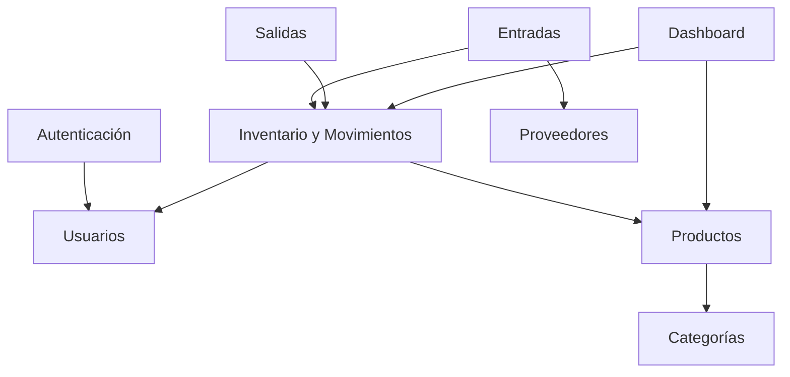

# Especificaciones Funcionales por Módulo

Esta carpeta describe las responsabilidades y criterios de aceptación de cada módulo de SuperStock. Las reglas y flujos no se duplican: se referencian desde [requerimientos.md](../requerimientos.md) y [casos_de_uso.md](../casos_de_uso.md).

## Módulos oficiales

| Módulo | Documento | Casos principales |
|---|---|---|
| Autenticación | [auth.md](auth.md) | CU-01, CU-02 |
| Usuarios | [usuarios.md](usuarios.md) | CU-03 |
| Categorías | [categorias.md](categorias.md) | CU-04 |
| Productos | [productos.md](productos.md) | CU-05, CU-10 |
| Proveedores | [proveedores.md](proveedores.md) | CU-11, apoyo a CU-07 |
| Inventario y Movimientos | [inventario.md](inventario.md) | CU-06, apoyo a CU-07, CU-08, CU-09 |
| Entradas | [entradas.md](entradas.md) | CU-07 |
| Salidas | [salidas.md](salidas.md) | CU-08 |
| Dashboard | [dashboard.md](dashboard.md) | CU-09 |

## Dependencias

## Reglas editoriales

- Cada módulo declara alcance, actores, dependencias y criterios de aceptación.
- Los códigos RF, CU y RN son la fuente de trazabilidad.
- La estructura de datos se consulta en [base_datos.md](../base_datos.md).
- Las decisiones de capas se consultan en [arquitectura.md](../arquitectura.md).
- Los patrones visuales se consultan en [design/ui-components.md](../design/ui-components.md).
- Una ampliación funcional requiere actualizar primero los documentos canónicos.

## Módulos retirados

Catálogo público, carrito, checkout, pedidos, WhatsApp, área de cliente y registro público de administradores no pertenecen a SuperStock y no deben reintroducirse desde la implementación heredada.

